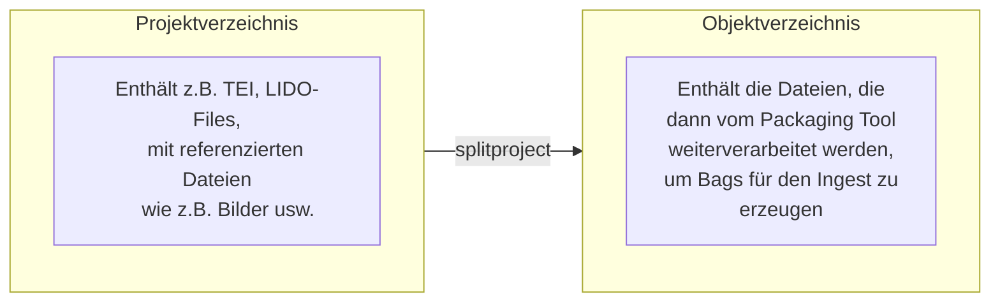

# Gamspreprocessor

## Überblick



Gamspreprocessor ist eine Sammlung von Werkzeugen zur Vorbereitung von
Gams-Ingests, die zu einem Befehl ('preprocess') zusammengefasst wurden.

Für ``preprocess`` selbst und für alle Unterbefehle gibt es die '--help' 
Option, die alle Möglichkeiten auflistet. 

``preprocess`` unterstützt diese globalen Optionen:

  * ``--logfile`` Ist diese Option gesetzt, wird zusätzlich zur normalen
    Ausgabe am Bildschirm eine Log-Datei mit dem Wert dieser Option angelegt. 
  * ``--filelog-level`` Es ist möglich, für die Logdatei ein anderes
    Loglevel einzustellen. Damit kann z.B. die Debug-Ausgabe in die Datei
    geschrieben werden, während die Ausgabe am Bildschirm weniger Ausgabe
    generiert. Der Wert dieser Option muss einer der folgenden Werte sein:

    * DEBUG
    * INFO
    * WARNING
    * ERROR
    * CRITICAL
  
    Groß- und Kleinschreibung spielt dabei keine Rolle.

  * ``--verbose`` (``-v``) Die Option setzte die Ausgabe auf DEBUG. Sie kann
    nicht zusammen mit ``--quiet`` verwedendet werden.  
  * ``--quiet``(``-q``) Diese Option minimiert die Ausgage auf 
    Fehlermeldungen. Sie kann nicht zusammen mit ``--verbose`` verwendet 
    werden. 
  * ``--version`` Gibt die Version von ``preprocess`` aus.
  * ``--help`` Gibt den Hilfetext für ``preprocess`` aus.

Aktuell sind diese Unterbefehle implementiert:

### splitproject

``preprocess splitproject`` wird dazu verwendet, bestehende Projektstrukturen
(wie in GAMS 3) so umzubauen, dass für jedes Objekt und seine Datenströme
ein eigenes Verzeichnis angelegt wird. Aktuell werden basale TEI und LIDO
Objekte unterstützt. 

``splitproject`` kann nicht direkt verwendet werden sondern erwartet einen
weiteren Unterbefehl: ``split`` erzeugt die Objektverzeichnisse, 
``showunhandled`` zeigt alle Dateien, die im Ursprungsverzeichnis vorhanden,
aber noch in keinem Objektverzeichnis verwendet werden. Diese Subbefehl
ist somit ein wichtiges Werkzeug, mit dem verhindert werden kann, dass Dateien
beim Aufsplitten von Objekten verloren gehen.

#### split
``split`` erwartet als Argument eine Liste von umzuwandelnden Dateien.
Das sind jeweils die für das Objekt zentralen Dateien. Im Normalfall liefert,
wenn Wildcards verwendet werden, die Shell eine entsprechende Liste. 

```
preprocess splitproject split '*TEI*.xml'
```

Es können aber auch eine Reihe von Dateien, jeweils durch ein Leerzeichen
getrennt, angegeben werden. 

```
preprocess splitproject split TEI_1.xml TEI_2.xml TEI99.xml
```

Eine weitere Möglichkeit, bei der dann kein Argument anzugeben ist, 
besteht in der Verwendung der ``--file-list`` Option (sieht unten).

```
preprocess splitproject split --file-list files_to_convert.txt
```

``split`` kennt diese Optionen:

  * ``--output-dir`` Über diese Option kann das Verzeichnis festgelegt werden,
    in dem die Objekt-Verzeichnisse erzeugt werden. Wird die Option nicht
    verwendet, nimmt der Splitter ein Verzeichnis ``objects``direkt
    unterhalb des aktuellen Verzeichnisses an. Das angegebenen Verzeichnis muss
    bereits existieren, wird also nicht automatisch angelegt.
  * ``object-format`` Erlaubt zur Zeit einen dieser Werte: ``auto`` (default),
    ``lido`` oder  ``tei``. Die explizite Festlegung des Typs sollte so gut wie
    nie nötig sein. *Ich überlege deshalb, diese Option wieder zu entfernen oder
    als Filter für Dateitypen zu verwenden.*
  * ``--file-list`` erwartet als Wert den Pfad zu einer Datei, in der
    die "Hauptdateien" gespeichert sind, nach denen gesplittet werden
    soll. Die Verwendung dieser Option ist eine Alternative zur 
    Auflistung der zu verarbeitenden Dateien auf der Kommandozeile
    (``SOURCEFILES``).
    Man kann also eine Liste der "Objektdateien" vorgenerieren (z.B. mit 
    ``find``) und diese Liste (eine Datei pro Zeile) an den Splitter
    übergeben. Die Option kann nicht zusammen dem Argument ``SOURCEFILES``
    verwendet werden.
  * ``--replace`` ``split`` überschreibt keine existierenden 
    Objektverzeichnisse. Durch das Setzen der ``--replace`` Option wird
    dieses Verhalten so verändert, dass bereits existierende 
    Objektverzeichnisse gelöscht und neu angelegt werden.
  * ``--reset`` Dieser Flag stellt den BookKeeper auf den Ausgangszustand zurück. 
    Diese Option sollte nur dann eingesetzt werden, wenn man alle Ordner
    unterhalb von ``--output-dir`` gelöscht hat und das Aufsplitten  in
    Projekte von vorne beginnen möchte. Diese Option setzt nur den
    BookKeeper zurück, löscht aber keine bereits erzeugten #
    Objektverzeichnisse.
  * ``--help`` zeigt die vom Unterbefehl bereitgestellten Argumente und Optionen


#### showunhandled

Dieser Unterbefehl zeigt alle Dateien, die zwar im oder unterhalb des
Ausgangsverzeichnisse vorhanden sind, jedoch in keinem Objektverzeichnis
verwendet werden. Er ist also ein wichtige Werkzeug, um sicherzustellen,
dass der Splitter alle vorhandenen Dateien verarbeitet hat.

Der Aufruf erwartet den Pfad zum Wurzelverzeichnis der Objektverzeichnisse
(das ist der Pfad, der als Option ``--output-dir`` bei ``split`` verwendet
wurde) als Argument:

```
preprocess splitproject showunhandled <Pfad>
```

Der Befehl kennt keine Optionen außer ``--help``.

