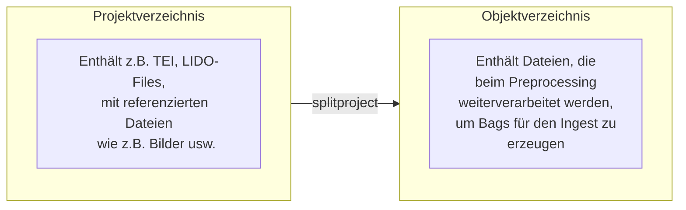
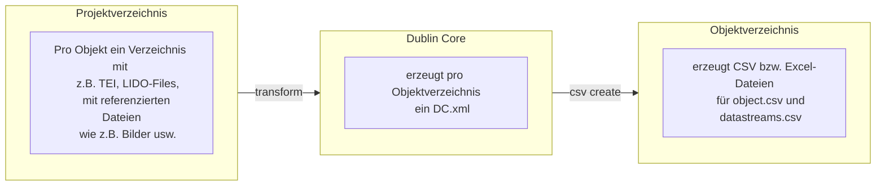

# Gamspreprocessor

## Überblick

Gamspreprocessor ist eine Sammlung von Werkzeugen zur Vorbereitung von
Gams-Ingests, die zu einem Befehl (`preprocess`) zusammengefasst wurden.

- mit `project init` kann ein neues Projekt erzeugt werden
- mit `splitproject` kann versucht werden aus vorhanden Verzeichnissen
  Objekt-Ordner zu erzeugen (z.B. von `Y:\data\projekte\...`)
- erzeugt mit entsprechenden XSLTs fehlende `DC.xml` für jedes Objekt(verzeichnis)
- erzeugt Excel- bzw. CSV-Dateien (`object.csv`, `datastreams.csv`)


Für ``preprocess`` selbst und für alle Unterbefehle gibt es die '--help' 
Option, die alle Möglichkeiten auflistet. 

``preprocess`` unterstützt diese globalen Optionen:

  * ``--logfile`` Ist diese Option gesetzt, wird zusätzlich zur normalen
    Ausgabe am Bildschirm eine Log-Datei mit dem Wert dieser Option angelegt. 
  * ``--filelog-level`` Es ist möglich, für die Logdatei ein anderes
    Loglevel einzustellen. Damit kann z.B. die Debug-Ausgabe in die Datei
    geschrieben werden, während die Ausgabe am Bildschirm weniger Ausgabe
    generiert. Der Wert dieser Option muss einer der folgenden Werte sein 
    und überschreibt den Wert im `project.toml`:

    - DEBUG
    - INFO
    - WARNING
    - ERROR
    - CRITICAL
  
    Groß- und Kleinschreibung spielt dabei keine Rolle.

  - ``--verbose`` (``-v``) Die Option setzte die Ausgabe auf DEBUG. Sie kann
    nicht zusammen mit ``--quiet`` verwedendet werden.  
  - ``--quiet``(``-q``) Diese Option minimiert die Ausgage auf 
    Fehlermeldungen. Sie kann nicht zusammen mit ``--verbose`` verwendet 
    werden. 
  - ``--version`` Gibt die Version von ``preprocess`` aus.
  - ``--help`` Gibt den Hilfetext für ``preprocess`` aus.

Aktuell sind diese Unterbefehle implementiert:

  - csv - create and manage the csv metadata files
  - multitransform - like tranform, but for many files
  - project  - initialize an update a project
  - splitproject - split up data from an existing project into object folders
  - transform - Transform datastreams
  # - validate - currently not available


### project init

- `preprocess project init <root-folder>` erzeugt im angegebenen 'root-folder' ein neues Projekt mit
  [project.toml](#projecttoml) Datei, die dann für das Projekt angepasst werden muss.

### splitproject



``preprocess splitproject`` wird dazu verwendet, bestehende Projektstrukturen
(wie in GAMS 3) so umzubauen, dass für jedes Objekt und seine Datenströme
ein eigenes Verzeichnis angelegt wird. Aktuell werden basale TEI und LIDO
Objekte unterstützt. 

``splitproject`` kann nicht direkt verwendet werden sondern erwartet einen
weiteren Unterbefehl: 
- ``split`` erzeugt die Objektverzeichnisse, 
- ``showunhandled`` zeigt alle Dateien, die im Ursprungsverzeichnis vorhanden sind,
aber noch in keinem Objektverzeichnis verwendet werden. Dieser Subbefehl
ist somit ein wichtiges Werkzeug, mit dem verhindert werden kann, dass Dateien
beim Aufsplitten von Objekten verloren gehen.

#### split
``split`` erwartet als Argument eine Liste von umzuwandelnden Dateien.
Das sind jeweils die für das Objekt zentralen Dateien. Im Normalfall liefert -
sofern Wildcards verwendet werden - die Shell eine entsprechende Liste. 

```sh
preprocess splitproject split '*TEI*.xml'
```

Es können aber auch eine Reihe von Dateien, jeweils durch ein Leerzeichen
getrennt, angegeben werden. 

```sh
preprocess splitproject split TEI_1.xml TEI_2.xml TEI99.xml
```

Eine weitere Möglichkeit, bei der dann kein Argument anzugeben ist, 
besteht in der Verwendung der ``--file-list`` Option:

```sh
preprocess splitproject split --file-list files_to_convert.txt
```

``split`` kennt diese Optionen:

  - ``--output-dir`` Über diese Option kann das Verzeichnis festgelegt werden,
    in dem die Objekt-Verzeichnisse erzeugt werden. Wird die Option nicht
    verwendet, nimmt der Splitter ein Verzeichnis ``objects``direkt
    unterhalb des aktuellen Verzeichnisses an. Das angegebene Verzeichnis **muss
    bereits existieren**, wird also nicht automatisch angelegt.
  - ``object-format`` Erlaubt zur Zeit einen dieser Werte: ``auto`` (default),
    ``lido`` oder  ``tei``. Die explizite Festlegung des Typs sollte so gut wie
    nie nötig sein. *Ich überlege deshalb, diese Option wieder zu entfernen oder
    als Filter für Dateitypen zu verwenden.*
  - ``--file-list`` erwartet als Wert den Pfad zu einer Datei, in der
    die "Hauptdateien" gespeichert sind, nach denen gesplittet werden
    soll. Die Verwendung dieser Option ist eine Alternative zur 
    Auflistung der zu verarbeitenden Dateien auf der Kommandozeile
    (``SOURCEFILES``).
    Man kann also eine Liste der "Objektdateien" vorgenerieren (z.B. mit 
    ``find``) und diese Liste (eine Datei pro Zeile) an den Splitter
    übergeben. Die Option kann nicht zusammen mit dem Argument ``SOURCEFILES``
    verwendet werden.
  - ``--replace`` überschreibt keine existierenden 
    Objektverzeichnisse. Durch das Setzen der ``--replace`` Option wird
    dieses Verhalten so verändert, dass bereits existierende 
    Objektverzeichnisse gelöscht und neu angelegt werden.
  - ``--reset`` Dieser Flag stellt den BookKeeper auf den Ausgangszustand zurück. 
    Diese Option sollte nur dann eingesetzt werden, wenn man alle Ordner
    unterhalb von ``--output-dir`` gelöscht hat und das Aufsplitten  in
    Projekte von vorne beginnen möchte. Diese Option setzt nur den
    BookKeeper zurück, löscht aber keine bereits erzeugten #
    Objektverzeichnisse.
  - ``--help`` zeigt die vom Unterbefehl bereitgestellten Argumente und Optionen


#### showunhandled

Dieser Unterbefehl zeigt alle Dateien, die zwar im oder unterhalb des
Ausgangsverzeichnisse vorhanden sind, jedoch in keinem Objektverzeichnis
verwendet werden. Er ist also ein wichtiges Werkzeug, um sicherzustellen,
dass der Splitter alle vorhandenen Dateien verarbeitet hat.

Der Aufruf erwartet den Pfad zum Wurzelverzeichnis der Objektverzeichnisse
(das ist der Pfad, der als Option ``--output-dir`` bei ``split`` verwendet
wurde) als Argument:

```sh
preprocess splitproject showunhandled <Pfad>
```

Der Befehl kennt keine Optionen außer ``--help``.

### transform und csv create




In der aktuellen Version unterstützt ``transform`` nur eine Art von Transformation: ``xslt``.
Dabei wird im Hintergrund ``saxon`` verwendet. Die verwendete Saxon-Version kann mit dem
Befehl

```sh
preprocess transform saxon-version
```

ermittelt werden.

#### transform xslt: erzeugen von DC.xml

Der ``xslt`` Befehl von Transform wendet eine XSLT Datei auf eine oder mehrere XML Dateien an:

```sh
preprocess transform xslt -x myxslt.xsl -o DC.xml foo/TEI.xml
```

wendet ``myxslt.xsl`` auf ``foo/TEI.xml`` an und schreibt die Ausgabe in die Datei
``foo/DC.xml``

Gibt man mehr als eine XML-Datei an (oder verwendet ein File-Pattern, das die Shell expandiert),
wird die XSLT-Datei auf alle XML-Dateien angewendet. Die erzeugte Ausgabe wird dabei jeweils
in das Verzeichnis geschrieben, in dem die originale XML Datei liegt.

```sh
preprocess transform xslt -x myxslt.xsl -o DC.xml foo/TEI.xml bar/TEI.xml
```

Erzeugt zwei neue Dateien: ``foo/DC.xml`` und ``bar/DC.XML``.

Alternativ zur Angabe von XML-Datei, können die zu transformierenden XML-Datei (mit Pfad)
zeilenweise in eine Datei geschrieben werden:


```sh
foo/TEI.xml
bar/TEI.xml
```

Diese Datei kann mit der ``-file-list`` (oder ``-l``) Option bekannt gemacht werden.
Nehmen wir an, dass die entsprechende Datei als ``xmls_to_process.txt`` abgespeichert
wurde. Dann kann sie so verwendet werden:

```sh
preprocess multitransform xslt -r -x myxslt.xsl -p 'TEI*.xml' -o DC.xml -l objects
```

## project.toml

Um die Metadaten-CSV-Dateien zu erstellen, benötigt der Preprocessor Daten über das Projekt, 
zu dem die Objekte gehören.
Diese Infos müssen in einer Konfigurationsdatei mit dem Namen `project.toml` bereitgestellt werden.
Diese sollte im Wurzelverzeichnis des jeweiligen Projekt liegen (also dort, wo auch der `objects` Ordner
liegt).
Mit der Option `-c` von `preprocess create csv`, kann auch eine andere Konfigurationsdatei 
angegeben verwendet werden, wir empfehlen jedoch `project.toml` im Projektverzeichnis zu verwenden.

Eine andere Möglichkeit, dauerhaft einen anderen Pfad zur Konfigurationdatei anzugeben, besteht darin,
eine Umgebungsvariable `GAMSCFG_PROJECT_TOML` zu setzen. Eine weitere Möglichkeit besteht in der
Verwendung einer `.env` Datei im aktuellen Verzeichnis mit und dem darin definierten Wert `poject_toml`.

Die Datei muss den Regeln des TOML-Formats folgen (https://toml.io). Derzeit ist
die Datei sehr einfach, da sie nur aus wenigen Elementen besteht. Hier ist ein Beispiel für das Projekt `hsa`:

```
[metdata]
project_id = "hsa"
creator = "Gams HSA Project"
publisher = "Gams"
funder = "Institut für Sprachwissenschaft, Universität Graz"
rights = "Creative Commons Attribution-NonCommercial 4.0 (https://creativecommons.org/licenses/by-nc/4.0/)"

[general]
desid_keep_extendsion = true
loglevel = "info"
format_detector = "" # to use an alternative detector 
format_detector_url = "" # URL of a dector service (currently unused)
```

`format_detector` erwartet zur Zeit einen der beiden Werte: 

  * `magika` (default) ein auf der Google Magika Bibliothek basierenden Detector
  * `base` ein minimaler Detector, der primär Dateinamen auswertet.

Die Toml-Datei **muss** die o.g. Felder enthalten.

Nur die Einträge im Abschnitt 'metdata', werden für die Metadaten-Extraktion in die CSV-Dateien verwendet.

Die vollständige Beschreibung der Konfigurationsdatei findet sich in der Dokumentation der gamslib. 
TODO: ad url as we've decided where the documentation should live.

### Eine Konfiguration erzeugen lassen

Mit dem Befehl 
```
preprocess project init
```

kann man sich eine Beispielskonfiguration erzeugen lassen. Diese muss danach noch an das jeweilige 
Projekt angepasst werden.

Dieser Befehl legt nicht nur eine neue Konfigurationsdatei an, sondern erzeugt auch ein basales
`.gitignore` und ein leeres `objects` Verzeichnis.

### Eine bestehende Konfiguration erweitern

Der Befehl `preprocess project update` erweitert eine bestehende Konfiguration um neue Felder. 
Bestehende Werte werden dabei nicht verändert. Solange das Format von `project.toml` noch nicht stabil ist, sollte diese Befehl ab und zu ausgeführt werden, um sicherzustellen, dass die
Konfigurationsdatei aktuell ist.


## Dublin Core (DC.xml)

- DC.xml **muss** vorhanden sein
- kann z.B. mit Hilfe eines XSLTs auf TEI erzeugt werden (s. gamspreprocessor)
- muss folgende Felder enthalten:
  - identifier
  - title
  - creator
  - rights
- optionale Felder für Filter (in der API) sind:
  - coverage
  - creator
  - language
  - subject
- kann weitere zusätzliche Felder enthalten wie bspw.
  - date (im ISO-Format?)
  - location 
  - ... (s. [DC Template](https://zimlab.uni-graz.at/gams/metadata/templates/dc_template.xml))

## csv create: CSV bzw. Excel-Dateien erzeugen
```sh
preprocess csv create <path-to-object-root-folder>

```

## CSV erzeugen 

Es werden zwei CSV-Dateien in jedem Objectordner erzeugt:

  * object.csv
  * datastreams.csv

Die Idee dahinter ist, die vom SIP benötigten und nicht automatisch ermittelbaren Metadaten so weit wie möglich vorzugenerieren.
Der Curator hat dann die Möglichkeit, diese Daten noch einmal zu überarbeiten und zu ergänzen, ehe sie als Ausgangspunkt
für die Erzeugung des SIP verwendet werden. Diese beiden Dateien landen nicht im SIP
(s.a. [packager](https://zimlab.uni-graz.at/gams5/production/packaging)).

### Beschreibung der Felder in object.csv

#### Überblick

| Key          | Required  | Beschreibung                               | Beispiel       |  
| ----------   | --------- | ------------------------------------------ | -------------- |
| recid        | true      | PID des dig. Objekts                       | detamax.diary |   
| title        | true      | Titel des dig. Objekts                     | Detamax Diary |     
| project      | true      | Projektkürzel                              | detamax       |   
| description  | false     | Beschreibung des dig. Objects              | Diary of Detamax    | 
| creator      | true      | Creator des dig. Objekts                   | Max Musterfrau  | 
| rights       | true      | Lizenz: Name (URI)                         | Public Domain (http://creativecommons.org/publicdomain/mark/1.0/)| 
| publisher    | true      | Publisher of object                        | GAMS | 
| source       | true      | Quelle aus der dig. Objekt generiert wurde | local |                 
| objectType   | true      | basierend auf dc:type                      | text |
| mainResource | false     | PID des Hauptdatenstroms                   | TEI.xml |
| funder       | true      | Fördergeber                                | FFW (ausschreiben?) |


#### recid

`recid` ist der Identifikator des digitalen Objekts. Also etwas wie `hsa.letters.123`.

Bei der Generierung des CSV (`preprocess csv create`) wird der Ordnername des Objekts als Defaultwert
eingetragen.

#### title

`title` ist der Titel des digitalen Objekts. Er wird aus DC.xml extrahiert. Fehlt der Wert
im DC.xml, wird der Name des Objekts (`recid`) verwendet.


#### project

`project` bezeichnet das Projektkürzel. Jedes digitale Objekt muss initial einem Projekt zugeordnet werden.
Ist der Wert von `project_id` in `project.toml` gesetzt, wird dieser Wert verwendet.


#### description

`description` ist die verbale Beschreibung des Objekts. Dieser Wert ist optional.


#### creator

`creator` ist der Name der Person, die das digitale Objekt erzeugt hat. Ist der Wert von `metadata.creator` in `project.toml` gesetzt, wird dieser Wert verwendet.

#### rights

Dieses Feld beschreibt die Nutzungsbedingungen (Lizenz) für das Objekt. Idealerweise sollte dies
der ausgeschriebene Name der Lizenz sein, gefolgt vom der URI zur Lizenz in runden Klammern:

```
Creative Commons Attribution-NonCommercial 4.0 (https://creativecommons.org/licenses/by-nc/4.0/)
```

Dieser Wert wird automatisch in dieser Reihenfolge ermittelt:

    1. Aus dem Dublin Core
    2. Aus `project.toml`: `metadata.rights`
    3. Der Defaultwert ( `Creative Commons Attribution-NonCommercial 4.0 (https://creativecommons.org/licenses/by-nc/4.0/)`)

#### source

`source` beschreibt die Herkunft der Daten. Er wird auf den Defaultwert `local` gesetzt und sollte gegebenfalls in der CSV-Datei geändert werden.

#### objectType

Dieser Wert beschreibt die Art des Objekts, wie im DCMI Type Vocabulary festgelegt (https://www.dublincore.org/specifications/dublin-core/dcmi-type-vocabulary/). Der Default Type ist `text`.


#### publisher

`publisher` legt fest, wer das Objekt publiziert hat. Standardmässig wird hier 'GAMS' verwendet.

#### mainResource

`mainResource` erwartet als Wert die ID (`dsid`) des "Hauptdatenstroms" des Objekts. Dies ist der Datenstrom, der bei Aufruf des Objekts angezeigt wird.
Falls es keinen Hauptdatenstrom gibt, kann der Wert leer bleiben.

#### funder

`funder` beschreibt, wer die Erstellung des Objekts finanziert hat. Ist in `project.toml` ein entsprechender Eintrag `metadata.funder` vorhanden, wird dieser verwendet.


### Beschreibung der Felder in datatstreams.csv


#### Überblick

| Key          | Required  |  Beschreibung                               |  Beispiel |  
|------------- | --------- |  ------------------------------------------ |  --------- |
| dspath       | true      |  Pfad zur Datei                             |  DC.xml |
| dsid         | true      |  Name des Datenstrims                       |  DC.xml |
| mimetype     | true      |  Content Type des Datastreams               |  image/jpeg |
| title        | false?    |  Titel des Datenstroms                      |  Dublin Core Metadata |
| description  | false     |  Beschreibung des Datenstroms               |  Portrait of M. Mustermann, ca. 1906 |
| creator      | true      |  Creator des Datenstroms                    |  Max Musterfrau |
| rights       | true?     |  Lizenz des Datenstroms: Name (URI)         |  Public Domain (http://creativecommons.org/publicdomain/mark/1.0/) |
| lang         | false     |  Sprache(n) des Datenstroms                 |  de; en  |
| tags         | false     |  Frei zu vergebende Tags                    |  foo; bar |


#### dspath

`dspath` beinhaltet den Pfad zu Datei des Datenstroms relativ zum Objektverzeichnis. Der korrekte Wert wird automatisch
gesetzt und sollte im Normalfall nicht verändert zu werden. 

#### dsid

Das ist der (finale) Name des Datenstroms. Dieser kann sich vom Dateinamen unterschieden, sollte aber der Übersichtlichkeit halber gleich sein. Der Name wird im Zuge der Generierung der CSV-Datei automatisch aus dem Dateinamen abgeleitet. Abhängig davon, ob in `project.toml` der Wert von `general.dsid_keep_extension`auf `true`(default) oder `false` steht, wird die Dateinamenerweiterung entweder erhalten oder abgestreift. 

#### mimetype

Beschreibt den Content Type des Datenstroms. Diesen explizit zu setzen, solle fast nie nötig sein, weil
er für viele Formate automatisch ermittelt werden kann. 

#### title

Ein Titel für den Datenstrom wird nur für einige wenige Dateinamen automatisch gesetzt:

Für einige wenige Dateinamen haben wir eigene Defaultwerte definiert:

  * `DC.xml`: "Dublin Core Metadata"
  * `RDF.xml: "RDF Statement"

Für alle anderen Datenströme bleibt das Feld beim automatischen Generieren der CSV Datei leer.


#### description

`description` ist die verbale Beschreibung des Inhalts der Datenstroms. Dieser Wert ist optional.
Automatisch befüllt wird dieses Feld nur für 'DC.xml': 
"Dublin Core meta data in XML format for this Object"


#### creator

`creator` ist der Name der Person, die das digitale Objekt erzeugt hat. Ist der Wert von `metadata.creator` in `project.toml` gesetzt, wird dieser Wert verwendet.

#### rights

Dieses Feld beschreibt die Nutzungsbedingungen (Lizenz) für das Objekt. Idealerweise sollte dies
der ausgeschriebene Name der Lizenz sein, gefolgt vom der URI zur Lizenz in runden Klammern:

```
Creative Commons Attribution-NonCommercial 4.0 (https://creativecommons.org/licenses/by-nc/4.0/)
```

Dieser Wert wird automatisch in dieser Reihenfolge ermittelt:

    1. Aus dem Dublin Core
    2. Aus `project.toml`: `metadata.rights`
    3. Der Defaultwert ( `Creative Commons Attribution-NonCommercial 4.0 (https://creativecommons.org/licenses/by-nc/4.0/)`)


#### lang

`lang` bezeichnet den oder die Sprache(n) des Datenstroms. Empfohlenes Format ist IETF BCP 47 
(https://www.rfc-editor.org/info/bcp47). Alternativ können ISO 639 Codes verwendet werden.

Mehrere Sprachen können durch ein Semikolon getrennt werden.

#### tags

Tags sind frei wählbare Bezeichner. Das Feld ist optional. Mehrere Werte werden durch Semikolons (`;`) voneinander getrennt.


